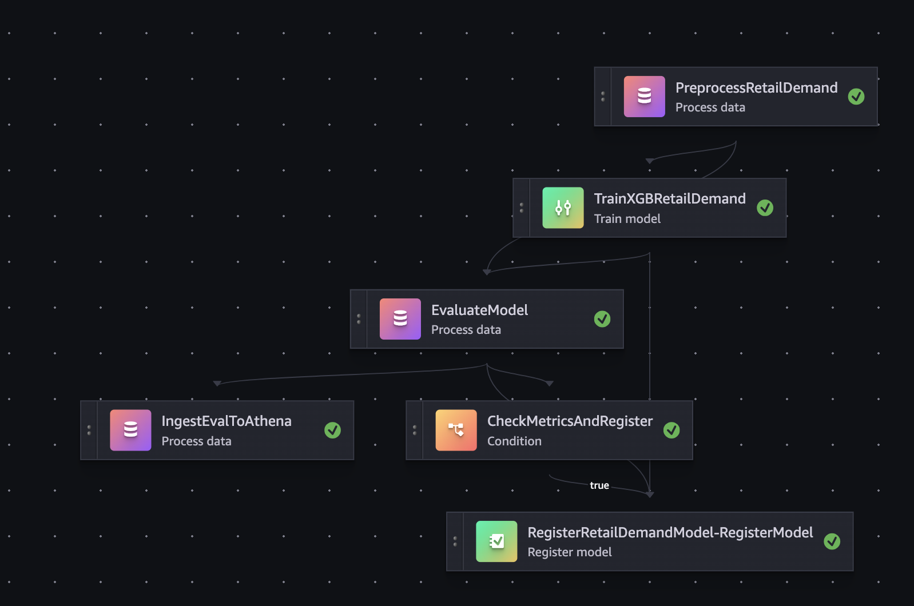

[README.md](https://github.com/user-attachments/files/24203814/README.md)
# Demand Forecasting MLOps Pipeline (SageMaker + Athena + Feature Store)

เอกสารนี้สรุปภาพรวม “MLOps แบบครบวงจร” สำหรับโปรเจกต์ **Retail Demand Forecasting** ที่สร้างด้วย AWS (SageMaker Pipelines, Model Registry, Feature Store, Athena, MLflow) และมีการแจ้งเตือน/ดีพลอยอัตโนมัติผ่าน SNS + EventBridge + Lambda

> อัปเดตล่าสุด: 2025-12-17

---

## ภาพรวมระบบ

### เป้าหมาย
- เทรนโมเดลพยากรณ์ยอดขาย (`units_sold`) ด้วย XGBoost
- ประเมินผล (metrics + bias + SHAP + data profile)
- บันทึกผลเพื่อทำ Dashboard/Monitoring ผ่าน Athena
- ลงทะเบียนโมเดลใน Model Registry (รออนุมัติ)
- เมื่ออนุมัติแล้ว ดีพลอยอัตโนมัติไปยัง **Serverless Endpoint** (ชื่อ endpoint เดิม → อัปเดตเป็นโมเดลรุ่นใหม่)

### บริการที่ใช้
- **Amazon S3**: เก็บข้อมูล, artifacts, outputs
- **Amazon Athena**: query ข้อมูลและสร้างตาราง monitoring
- **SageMaker Feature Store (Offline)**: เก็บ feature ระยะยาว
- **SageMaker Pipelines**: ออโตเมชันงาน ML (preprocess → train → eval → register)
- **SageMaker Model Registry**: governance + approval
- **MLflow (SageMaker MLflow Tracking Server)**: track experiment/metrics/artifacts
- **Amazon SNS + EventBridge + AWS Lambda**: แจ้งเตือนและ auto-deploy เมื่อ Approved

---

## แผนภาพ Pipeline



Pipeline หลักประกอบด้วย 6 ขั้นตอน:

1) `PreprocessRetailDemand`  
2) `TrainXGBRetailDemand`  
3) `EvaluateModel`  
4) `IngestEvalToAthena`  
5) `CheckMetricsAndRegister` (Condition)  
6) `RegisterRetailDemandModel-RegisterModel` (Register Model)

---

## คำอธิบายแต่ละ Step

### 1) PreprocessRetailDemand
ทำหน้าที่:
- อ่านข้อมูลดิบจาก S3 (CSV) แล้วทำ feature engineering
- สร้าง label เพิ่ม `high_demand`
- split เป็น train/validation/test แล้วเขียนออกเป็น CSV
- ingest feature เข้า **Feature Store (Offline store)**

ไฟล์/สคริปต์ที่เกี่ยวข้อง:
- `preprocess-scikit-retail-feature-store_NEW.py`

Outputs (ตัวอย่าง path):
- `.../output/retail_product/train/train.csv`
- `.../output/retail_product/validation/validation.csv`
- `.../output/retail_product/test/test.csv`

---

### 2) TrainXGBRetailDemand
ทำหน้าที่:
- เทรนโมเดล XGBoost ผ่าน `training.py`
- ใช้ channel: `train`, `validation`, `test`
- บันทึก model artifact (`model.tar.gz`) และ track ไปที่ MLflow

ไฟล์/สคริปต์ที่เกี่ยวข้อง:
- `training.py`

หมายเหตุ:
- ในระบบนี้เราใช้ “feature order” แบบคงที่ (hard-coded) เพื่อความเสถียรของ inference/evaluation

---

### 3) EvaluateModel
ทำหน้าที่:
- โหลด model artifact จาก training step
- โหลด test set จาก preprocess step
- คำนวณ metrics (RMSE/MAE/R²) + bias + SHAP + data profile
- เขียน outputs ลงโฟลเดอร์ evaluation
- log metric/artifacts ไป MLflow

ไฟล์/สคริปต์ที่เกี่ยวข้อง:
- `evaluate.py`

Outputs ที่สำคัญ:
- `evaluation_summary.json` / `evaluation_summary.csv`
- `test_predictions.csv`
- `data_profile.json`
- `shap_feature_importance.csv`
- `evaluation_regression_metrics.json` (ใช้กับ Model Registry)

---

### 4) IngestEvalToAthena
ทำหน้าที่:
- อ่านผลจาก evaluation output
- แปลง/จัดรูปแบบเพื่อ query ได้ง่าย
- เขียนไปยัง S3 monitoring prefix และสร้าง/อัปเดต Athena tables (ถ้าจำเป็น)

ไฟล์/สคริปต์ที่เกี่ยวข้อง:
- `ingest_to_athena.py`

Database/ตารางที่สร้าง (ตัวอย่าง):
- `monitor_retail_demand.evaluation_summary`
- `monitor_retail_demand.data_profile`
- `monitor_retail_demand.shap_feature_importance`
- `monitor_retail_demand.test_predictions`

---

### 5) CheckMetricsAndRegister (Condition)
ทำหน้าที่:
- อ่านค่า `rmse` และ `r2` จาก `evaluation_summary.json` ผ่าน PropertyFile + JsonGet
- ถ้า “ผ่านเกณฑ์” → ไป Register Model
- ถ้าไม่ผ่าน → ข้ามการ Register (แต่ IngestEval ยังทำอยู่)

ตัวอย่างเกณฑ์:
- `rmse <= RMSEThreshold`
- `r2 >= R2Threshold`

---

### 6) RegisterRetailDemandModel-RegisterModel
ทำหน้าที่:
- ลงทะเบียนโมเดลเข้า **Model Package Group** (Model Registry)
- ตั้งสถานะเริ่มต้นเป็น `PendingManualApproval`
- แนบ ModelMetrics (เช่น regression metrics JSON)

ผลลัพธ์:
- ได้ Model Package Version ใหม่ใน Model Registry

---

## การแจ้งเตือนและ Auto-deploy หลัง Approve

### เมื่อ Register แล้ว (PendingManualApproval)
- EventBridge จับ event “Model Package State Change”
- Lambda ส่งข้อความไป SNS → email ถึงผู้อนุมัติ

### เมื่อผู้ใช้กด Approved
- EventBridge จับ event อีกครั้ง (Approved)
- Lambda deploy **serverless endpoint**:
  - ถ้า endpoint มีอยู่แล้ว → `UpdateEndpoint` เพื่อ “แทนรุ่นเก่า” ด้วยรุ่นใหม่ (ชื่อ endpoint เดิม)
  - ถ้ายังไม่มี → `CreateEndpoint`

> แนวคิดสำคัญ: ใช้ endpoint name คงที่ (เช่น `retail-demand-xgb-serverless-prod`) เพื่อให้ client ไม่ต้องเปลี่ยนปลายทาง

---

## โครงสร้างโฟลเดอร์ (ตัวอย่าง)

- `01_setup_role_permission/` : setup role/permission
- `02_ingest/` : ingest data เข้า S3/Athena (ฝั่ง DE)
- `03_explore/` : EDA / data quality
- `04_prepare/` : preprocessing + feature store
- `05_train/` : training (XGBoost + MLflow)
- `06_evaluate/` : evaluate (metrics/bias/shap)
- `07_monitor_eval/` : ingest monitoring results เข้า Athena
- `08_deploy/` : deploy endpoint
- `09_inference/` : inference client / example calls

---

## วิธีรันแบบสั้น ๆ

### รัน pipeline (ตัวอย่าง)
```python
pipeline = get_pipeline()
pipeline.upsert(role_arn=role)
execution = pipeline.start()
print(execution.arn)
```

### ตรวจสอบ endpoint หลัง Approved
- SageMaker → Endpoints → ดู `EndpointStatus` และ `EndpointConfigName`

---

## Troubleshooting ที่พบบ่อย

- **feature_columns.json ไม่อยู่ใน model artifact**  
  → ใช้ feature order แบบ fixed list (`FEATURE_ORDER`) ในทั้ง evaluate/inference

- **Pipeline แสดงว่า Register เชื่อมกับ Train**  
  → เป็น dependency (Register ต้องใช้ model artifact) แต่ “จะรันจริง” เฉพาะเมื่อ Condition = true

- **SNS ได้เมลแล้วแต่ deploy ไม่ทำงาน**  
  → เช็ค Lambda IAM policy เช่น `sagemaker:AddTags`, `iam:PassRole` และดู CloudWatch logs ของ Lambda

---

ถ้าต้องการขยายต่อ (Production monitoring / drift) แนะนำทำ “Monitoring job รายวัน” ที่ใช้ Athena tables ใน `monitor_retail_demand` เพื่อสร้าง dashboard/alert ใน QuickSight/CloudWatch
